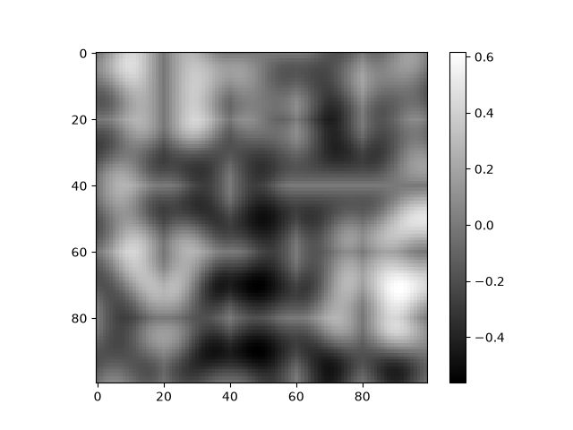

# Perlin Noise From Scratch

This is a small Python project where I implemented 2D Perlin noise from scratch.

I started this because I wanted to understand how procedural generation works in games, especially how things like Minecraft can generate terrain from a seed without storing the whole world.

The project uses a permutation table, gradient vectors, dot products, a fade function and linear interpolation to generate smooth noise.

## Example



## How it works

For each point in the noise map:

1. The point is placed inside a grid cell.
2. A gradient vector is chosen for each corner using a permutation table.
3. The distance from each corner to the point is calculated.
4. The dot product is taken between the gradient and distance vectors.
5. The x and y positions are passed through the Perlin fade function.
6. The corner values are interpolated together to get the final noise value.

The fade function used is:

```text
6t^5 - 15t^4 + 10t^3