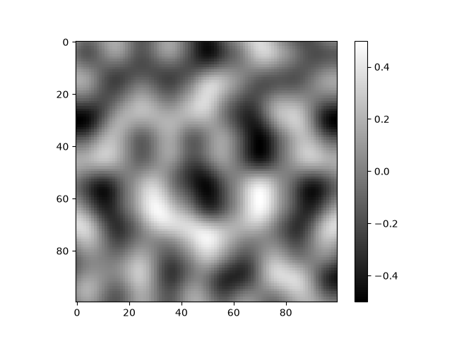
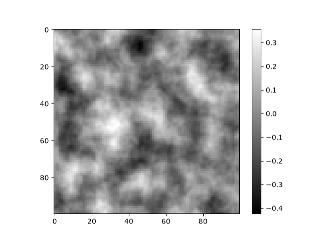

# Perlin Noise From Scratch

This is a small Python project where I implemented 2D Perlin noise from scratch.

I started this because I wanted to understand how procedural generation works in games, especially how things like Minecraft can generate terrain from a seed without storing the whole world.

The project uses a permutation table, gradient vectors, dot products, a fade function and linear interpolation to generate smooth noise.

## Example

<table>
  <tr>
    <td align="center">
      <br>
      <b>1 Octave</b>
    </td>
    <td align="center">
      <br>
      <b>4 Octaves</b>
    </td>
  </tr>
</table>

Both examples below were generated using seed `130105`.

## How it works

For each point in the noise map:

1. The point is placed inside a grid cell.
2. A gradient vector is chosen for each corner using a permutation table.
3. The distance from each corner to the point is calculated.
4. The dot product is taken between the gradient and distance vectors.
5. The x and y positions are passed through the Perlin fade function.
6. The corner values are interpolated together to get the final noise value.

The fade function used is:

```text
6t^5 - 15t^4 + 10t^3
```

## Octaves

The noise generator also supports multiple octaves.

Each octave samples the same Perlin noise at a different frequency. Higher octaves use a higher frequency, which adds smaller details to the noise map.

The amplitude is reduced for each octave so that the smaller details have less influence on the final result.

For example:

- Octave 1: frequency 1, amplitude 1
- Octave 2: frequency 2, amplitude 0.5
- Octave 3: frequency 4, amplitude 0.25
- Octave 4: frequency 8, amplitude 0.125

The values from each octave are added together and then divided by the total amplitude to keep the final noise value in a sensible range.

Using multiple octaves makes the output look more detailed and natural compared with a single layer of Perlin noise.

## Features

- 2D Perlin noise
- Seeded permutation table
- Multiple octaves
- Adjustable number of octaves
- NumPy-based calculations
- Matplotlib visualisation

## Tutorial

For a full guide on using the package, see the [tutorial](docs/tutorial.md).